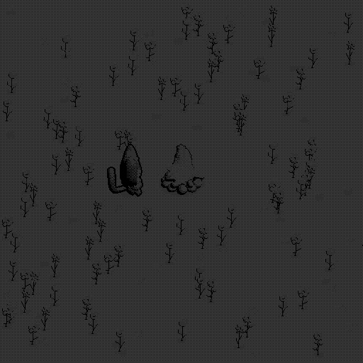
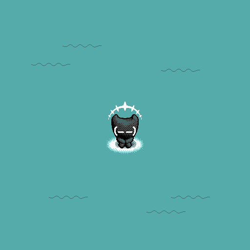
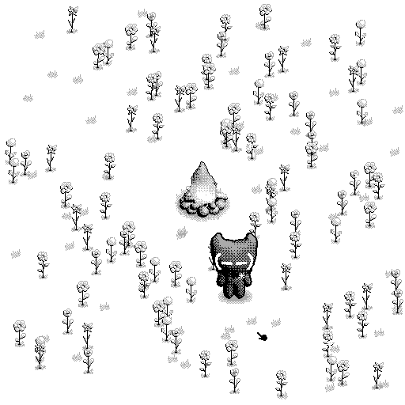

# DRELOC.rom

> [!WARNING]
> May contain flashing lights

*It just wants to live a peacefull life...*

*Keep your fire alive.*

A small demo game for [UXN] made in [UXNSMAL].

[UXN]: https://100r.co/site/uxn.html
[UXNSMAL]: https://github.com/bbogdan-ov/uxnsmal





## Play

To play DRELOC.rom simply download [`output.rom`](./output.rom) and open it with your
favorite UXN VARVARA emulator.

If you don't have one, you can use [the web emulator](https://rabbits.srht.site/uxn5/).

## Building

To build this project first clone and compile [UXNSMAL] compiler.

```sh
uxnsmal dreloc.smal
uxnemu output.rom
```

## License

MIT license

Do whatever you want
